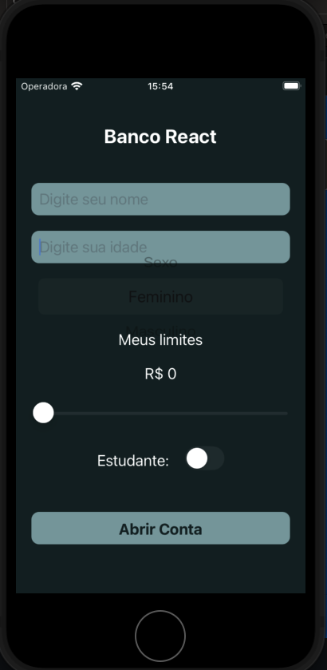
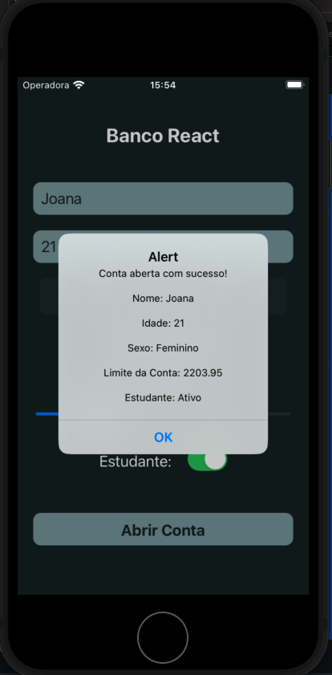
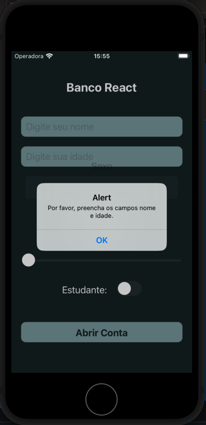

# BANCO REACT - DESAFIO REACT NATIVE

## Bem-vindo! 👋

Esse projeto faz parte de um desafio de código do curso sujeito programador;

## O desafio

- O usuário serão capazes de preencher:
   - Nome;
   - Idade;
   - Sexo;
   - Limite;
   - Se é estudante
   - Criar uma conta

- Alerta de erro:
  - se os campos nome e idade não forem devidamente preenchidos

## Como rodar o projeto:

>**Nota**: Certifique-se de ter concluído as instruções do Configuração do Ambiente -[React Native](https://reactnative.dev/docs/environment-setup) até a etapa "Criando um novo aplicativo" antes de prosseguir.

### Passo 1: Inicie o Metro Server
Primeiro, será necessário iniciar o Metro, o bundler JavaScript que acompanha o React Native.

Para iniciar o Metro, execute o seguinte comando no root do seu projeto React Native:

```bash
# using npm
npm start

# OR using Yarn
yarn start
```

### Passo 2: Inicie seu Aplicativo
Deixe o Metro Bundler rodando em seu próprio terminal. Abra um novo terminal no root do seu projeto React Native. Execute o seguinte comando para iniciar seu aplicativo _Android_ ou _iOS_:

### Para Android

```bash
# using npm
npm run android

# OR using Yarn
yarn android
```

### Para iOS

```bash
# using npm
npm run ios

# OR using Yarn
yarn ios
```

### Screenshots





### Built with
- React-native
- Xcode
- Xcode-simulator

